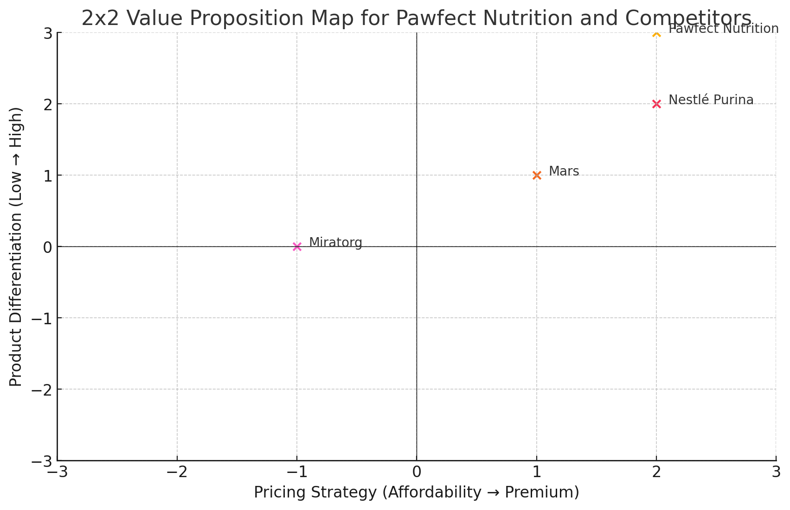

# Table of Contents

1. [Product Overview](#Product-Overview)
2. [Consumer Profile](#Consumer-Profile)
3. [Consumer Needs](#Consumer-Needs)
4. [Competitors](#Competitors)
5. [Business Aspirations](#Business-Aspirations)
6. [Threat of New Entrants](#Threat-of-New-Entrants)
7. [Supplier Power](#Supplier-Power)
8. [Threat of Substitution](#Threat-of-Substitution)
9. [Buyer Power](#Buyer-Power)
10. [Top Competitor Brands](#Top-Competitor-Brands)
11. [Mars Incorporated - SWOT Summary](#Mars-Incorporated---SWOT-Summary)
12. [Nestlé Purina - SWOT Summary](#Nestlé-Purina---SWOT-Summary)
13. [Miratorg - SWOT Summary](#Miratorg---SWOT-Summary)
14. [Competitive Strategy for Pawfect Nutrition](#Competitive-Strategy-for-Pawfect-Nutrition)
15. [Comparative SWOT Table](#Comparative-SWOT-Table)
16. [2x2 Value Proposition Mapping](#2x2-Value-Proposition-Mapping)
17. [Pawfect Nutrition Market Position - Summary](#Pawfect-Nutrition-Market-Position---Summary)
18. [Core Capabilities Summary](#Core-Capabilities-Summary)

---

# Product Overview

**Pawfect Nutrition** offers premium, organic pet food for cats and dogs, focusing on grain-free diets and health-specific formulations for issues like digestive sensitivity and renal problems. With growing consumer demand for high-quality, health-conscious pet food, Pawfect Nutrition targets a lucrative market. 

### **Key Stats**:
- **Market Value**: RUB 357 billion (USD 3.86B) for pet food in 2023, with growing demand for premium, health-focused options.
- **Premium Segment**: Driven by “pet humanization,” specialized diets, and demand for organic, grain-free products.
- **Import Gap**: Exit of major brands (Hill’s, Purina) leaves space for local premium players like Pawfect Nutrition.
- **Production**: 1.4M tons of pet food produced domestically in 2023.
- **E-commerce Growth**: E-commerce reached 22% of pet food sales in 2023.

# Consumer Profile

- **Target Audience**: 85% of Russian pet owners see their pets as family members (2023).
- **Consumer Demand**: Increased focus on health, wellness, and specialized diets (digestive, renal).
- **E-commerce**: 22% of pet food sales via e-commerce channels by mid-2023.
- **Price Sensitivity**: 72% of consumers are budget-conscious but still seek premium quality.
- **Local Preference**: 57% of consumers prefer local brands due to import restrictions.

# Consumer Needs

- **Health Focus**: Rising demand for grain-free, organic pet food with functional ingredients like probiotics.
- **Specialized Diets**: High demand for therapeutic pet food targeting renal issues, digestion, etc.
- **Affordability**: 72% of consumers prioritize quality but remain price-sensitive.
- **Local Alternatives**: 57% of consumers prefer local pet food due to import restrictions, but quality concerns persist.

# Competitors

- **Major Players**: Mars and Nestlé still dominate premium pet food market in Russia.
- **Local Competitors**: Brands like PetKorm and Grandorf are expanding, with PetKorm producing 10,000 metric tons annually.
- **Local Preferences**: 57% of pet owners prefer locally made food due to import restrictions.
- **Challenges**: Local brands face quality concerns, while international brands retain strong loyalty.

# Business Aspirations

- **Market Growth**: Russian premium pet food market projected to reach **USD 10.92B by 2029** (CAGR of 11.42%).
- **Production Expansion**: Domestic production grew to **1.38M tons** in 2022, with plans for further expansion.
- **Sustainability Focus**: Increasing demand for eco-friendly, health-focused products with functional ingredients.
- **E-commerce**: **22% of sales** in 2023 were online; focus on AI-driven personalization and loyalty programs.

---
---
---

# Threat of New Entrants - Summary for Pawfect Nutrition

The **Russian premium pet food market** offers some entry opportunities, but significant barriers exist:

- **Time & Cost**: High initial investments (₽50B for premium facilities). Production grew 4.5% in 2022 to 1.38M tons.
- **Specialist Knowledge**: Expertise in formulating specialized diets (digestive, renal) critical for market entry.
- **Economies of Scale**: Established players like Miratorg have a significant cost advantage due to large-scale operations.
- **Cost Advantages**: High costs for raw materials, especially grain-free and organic ingredients.
- **Technology Protection**: No significant tech patents but complex production processes (e.g., extrusion) needed.
- **Barriers to Entry**: Stricter regulations and import bans on foreign brands; local production preferred.

**Conclusion**: Moderate threat for new entrants due to high costs, expertise requirements, and regulatory hurdles.

---

# Supplier Power - Summary for Pawfect Nutrition

- **Number of Suppliers**: Domestic production up by 4.5% in 2022; key players include Mars and Nestlé Purina.
- **Size of Suppliers**: Large multinational companies like Nestlé and Mars have production plants in Russia, giving them negotiating power over smaller brands.
- **Uniqueness of Service**: Few suppliers offer premium ingredients like grain-free and organic, driving their power in the market.
- **Ability to Substitute**: Substitution is difficult, as high-quality alternatives are limited in Russia.
- **Cost of Changing**: High, due to geopolitical tensions and supply chain issues, particularly for premium ingredients.

**Conclusion**: Supplier power is high, especially for premium ingredients and specialized services.

---

# Threat of Substitution - Summary for Pawfect Nutrition

- **Substitute Performance**: Main substitutes (homemade diets, economy pet food) offer lower quality and less nutritional balance. Premium diets like Pawfect Nutrition address health-specific needs.
- **Cost of Change**: High switching costs due to pet health risks. Prices for premium food increased by 41.3% between 2020 and 2022, but owners remain loyal to health-specific products.

**Conclusion**: Moderate threat; lower-cost substitutes exist, but switching is costly and risky for health-conscious pet owners.

---

# Buyer Power - Summary for Pawfect Nutrition

- **Number of Customers**: Expanding base; market projected to reach **USD 10.92 billion by 2029**.
- **Size of Each Order**: Small and frequent for individual buyers; larger retailers leverage better terms.
- **Differences Between Competitors**: Strong differentiation through health-specific formulations reduces buyer switching.
- **Price Sensitivity**: Rising costs (15-30%) increase price sensitivity; e-commerce accounts for **22% of sales**.
- **Ability to Substitute**: Premium customers reluctant to substitute; prefer health benefits of premium products.
- **Cost of Changing**: Moderately high; brand loyalty strong due to health concerns.

**Conclusion**: Moderate buyer power; price sensitivity is rising, but brand loyalty mitigates the risk.

---
---
---

# Top Competitor Brands - Summary for Pawfect Nutrition

- **Colgate-Palmolive (Hill's Pet Nutrition)**: Strong presence with health-focused veterinary diets.
- **Farmina Pet Foods**: Italian brand; known for premium, natural pet foods.
- **Mars Incorporated**: Dominates with brands like Royal Canin and Pedigree in both premium and mass-market segments.
- **Nestlé Purina**: Offers a wide range of products, including Pro Plan for premium customers.
- **Vafo Praha**: Czech company with health-focused brands like Brit.

## Local Competitors:
- **Miratorg**: Expanded into premium pet food with local, high-quality ingredients.
- **Grandorf**: Focuses on natural, hypoallergenic, and grain-free products.
- **Alpintech**: Gaining market share with locally-produced premium products.

## The Most Dangerous Competitors for Pawfect Nutrition
- **Mars Incorporated**: Dominates with brands like Royal Canin and Pedigree, vast distribution, and strong retailer relationships.
- **Nestlé Purina**: Strong foothold in premium segment with trusted products like Pro Plan, global resources, and expertise.
- **Miratorg Agribusiness Holding (Local)**: Largest Russian meat producer, expanding aggressively into pet food with locally-sourced premium ingredients and strong supply chain networks.

These companies pose the biggest competitive threats due to their resources, distribution power, and customer trust.

---

# Mars Incorporated - SWOT Summary

**Strengths**:
- Dominant market share (~40-50%) in Russia with brands like Royal Canin and Pedigree.
- Strong distribution network and brand reputation.
- Technological leadership in pet food R&D.

**Weaknesses**:
- Dependence on imported ingredients, vulnerable to supply chain issues.
- Premium pricing limits affordability for price-sensitive consumers.

**Opportunities**:
- Growth in premium pet food market and e-commerce expansion (22% of sales).
- Innovation in health-specific diets and veterinary partnerships.

**Threats**:
- Rising local competition from brands like Miratorg.
- Economic instability and consumer preference shifts to local products.

Mars is a dominant player but faces rising competition and economic challenges.

---

# Nestlé Purina - SWOT Summary

**Strengths**:
- Strong brand reputation and wide product range (e.g., Pro Plan).
- High ingredient quality and technological innovation in pet health diets.
- Extensive distribution network across retail and e-commerce.

**Weaknesses**:
- Reliance on imported ingredients exposes supply chain risks.
- High pricing may limit appeal among price-sensitive consumers.

**Opportunities**:
- Growing premium pet food market and rising e-commerce sales.
- Potential to expand veterinary partnerships and health-focused products.

**Threats**:
- Increased competition from local brands like Miratorg.
- Economic instability and shifting consumer preferences toward local products.

Nestlé Purina’s strengths lie in innovation and brand trust, but it faces risks from economic pressures and local competition.

---

# Miratorg - SWOT Summary

**Strengths**:
- Control over high-quality, locally-sourced ingredients.
- Trusted brand reputation in the Russian market.
- Competitive pricing due to local supply chain control.

**Weaknesses**:
- Limited product range and lack of specialized diets.
- Inexperienced in marketing premium pet food.

**Opportunities**:
- Growth in premium pet food and new consumer segments.
- Potential for R&D innovations and expansion into e-commerce.

**Threats**:
- Intense competition from Mars, Nestlé Purina, and local brands.
- Economic instability may reduce demand for premium products.

Miratorg leverages its local supply chain but needs product diversification and marketing improvements to compete long-term.

---

# Competitive Strategy for Pawfect Nutrition

- **Control over supply chain**: Own or partner with local farmers for high-quality, locally-sourced ingredients.
- **R&D investment**: Develop health-specific, functional, and premium products to target niche segments.
- **Digital ownership**: Build community platforms and websites to educate consumers and foster loyalty.
- **Veterinary partnerships**: Collaborate with clinics for endorsements of health-focused products.
- **E-commerce expansion**: Offer personalized services and subscription models via robust e-commerce.
- **"Made in Russia" appeal**: Emphasize local production to tap into nationalist consumer preferences.

These strategies will position Pawfect Nutrition to compete effectively with international and local players in Russia's premium pet food market.

---

# Competitive Strategy - Pawfect Nutrition

- **Own Farms**: Control quality, reduce costs, and leverage "Made in Russia" branding with locally-sourced ingredients.
- **VK.com Groups**: Engage pet owners directly, build loyalty, gather feedback, and educate consumers.
- **R&D**: Focus on health-specific products (e.g., hypoallergenic, digestive care) to differentiate in the premium market.
- **E-commerce**: Offer subscription services and personalized products to boost direct-to-consumer sales.
- **Veterinary Partnerships**: Build trust and promote health-focused products with vet endorsements.

This approach allows Pawfect Nutrition to compete effectively with international and local brands by combining local production, consumer engagement, and innovation.

---

# Pawfect Nutrition - SWOT Summary

**Strengths**:
- Unique health-specific products with locally-sourced ingredients.
- "Made in Russia" appeal with cost-efficient local production.
- Direct engagement with consumers via VK.com communities.

**Weaknesses**:
- Limited product range compared to major competitors.
- Lower brand recognition and weaker marketing strategy.

**Opportunities**:
- Growth in premium pet food market and online sales.
- Partnerships with veterinarians for brand endorsement.

**Threats**:
- Intense competition from international and local players.
- Economic instability and changes in consumer preferences.

Pawfect Nutrition has strong local advantages but needs to expand its range and strengthen marketing to capture more market share.

---

# Comparative SWOT Table - Pawfect Nutrition vs Competitors

| **Company**        | **Strengths**                                            | **Weaknesses**                                        | **Opportunities**                                        | **Threats**                                            |
|--------------------|---------------------------------------------------------|------------------------------------------------------|---------------------------------------------------------|--------------------------------------------------------|
| **Pawfect Nutrition** | Health-specific products, local sourcing, direct engagement | Limited product range, weaker marketing               | Premium market growth, e-commerce, vet partnerships      | Intense competition, economic instability               |
| **Mars**           | Strong market share, diverse products, extensive R&D    | Reliance on imports, high premium pricing             | Health-specific innovations, e-commerce growth           | Competition from local brands, economic risks           |
| **Nestlé Purina**  | Strong brand, wide product range, innovation             | High pricing, reliance on imports                    | E-commerce, veterinary partnerships                      | Local competition, economic downturns                   |
| **Miratorg**       | Control over supply, local brand, competitive pricing    | Limited premium range, less marketing experience      | Expansion into premium pet food, "Made in Russia" appeal | Competition from international brands, economic shifts  |

---
---
---

# 2x2 Value Proposition Mapping - Summary

**Parameters**:
1. **Product Differentiation (Specialization)**: Measures how specialized or unique the product offerings are (e.g., health-specific, premium).
2. **Pricing Strategy (Affordability vs. Premium)**: Assesses whether the brand competes on price or positions itself as premium.

**Axes**:
- **Vertical**: Product Differentiation (Low → High)
- **Horizontal**: Pricing Strategy (Affordable → Premium)

**Competitor Mapping**:
- **Pawfect Nutrition**: High differentiation, premium pricing.
- **Mars**: Mid differentiation, mix of affordable and premium.
- **Nestlé Purina**: High differentiation, premium pricing.
- **Miratorg**: Lower differentiation, more affordable pricing.

---

# 2x2 Value Proposition Map

Here is the 2x2 Value Proposition Map for Pawfect Nutrition and its competitors, based on the parameters of Product Differentiation (Specialization) and Pricing Strategy. The axis ranges from -3 to 3, and you can see how each brand is positioned:

- Pawfect Nutrition: High differentiation, premium pricing.
- Mars: Mid-level differentiation and pricing.
- Nestlé Purina: High differentiation, premium pricing.
- Miratorg: Lower differentiation, more affordable pricing.

This map allows for a visual comparison of where each brand stands in the competitive landscape. Let me know if you'd like to save this as an image or modify the chart further!

---

# Pawfect Nutrition Market Position - Summary

**Why it’s good**:
- Targets premium customers who value health and quality.
- Differentiates with specialized, natural products.
- Leverages local production with a "Made in Russia" appeal.

**Challenges**:
- Low brand recognition compared to established competitors.
- Price sensitivity may limit premium market size.
- Resource-intensive to maintain premium positioning.

**Focus Areas**:
- Build brand awareness through targeted marketing and education.
- Leverage local sourcing and premium quality to attract niche consumers.

---
---
---

# Core Capabilities - Summary

| **Capability**          | **Pawfect Nutrition**                      | **Mars**                         | **Nestlé Purina**                | **Miratorg**                   |
|-------------------------|--------------------------------------------|----------------------------------|----------------------------------|--------------------------------|
| **Technology**           | Health-specific, limited R&D               | Strong R&D, innovation           | Advanced research                | Strong in agriculture, limited |
| **Manufacturing**        | Local production, small scale              | Global, high-efficiency          | High-quality, broad range        | Cost-efficient, local           |
| **Distribution**         | Limited, e-commerce focused                | Extensive global                 | Wide, retail & vet clinics       | Strong local, growing           |
| **Marketing**            | Engaged via VK.com, limited campaigns      | Global, extensive campaigns      | Strong health & vet marketing    | Limited, local sourcing         |
| **Skills**               | Health-focused, limited product dev speed  | Superior workforce, fast dev     | Expertise in nutrition, fast dev | Agricultural expertise          |
| **Organizational**       | Agile, quick to respond                   | Large, global systems            | Experienced, global management   | Strong local control            |

**Conclusion**: Pawfect Nutrition excels locally but needs to scale up to compete with Mars and Nestlé Purina, while Miratorg poses a local challenge with cost-efficient production.