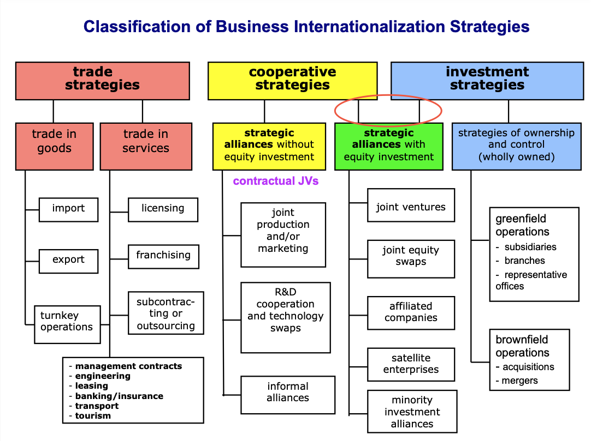

# Classification of Business Internationalization Strategies:

1. Trade Strategies
   - Trade in Goods:
     - Import
     - Export
     - Turnkey Operations
   - Trade in Services:
     - Licensing
     - Franchising
     - Subcontracting or Outsourcing
     - Management Contracts
     - Engineering
     - Leasing
     - Banking/Insurance
     - Transport
     - Tourism

2. Cooperative Strategies
   - Strategic Alliances without Equity Investment (contracctual JVs):
     - Joint Production and/or Marketing
     - R&D Cooperation and Technology Swaps
     - Informal Alliances
   - Strategic Alliances with Equity Investment (also connected to 3. Investment Strategies):
     - Joint Ventures
     - Joint Equity Swaps
     - Affiliated Companies
     - Satellite Enterprises
     - Minority Investment Alliances

3. Investment Strategies
   - Strategies of Ownership and Control (Wholly Owned):
     - Greenfield Operations:
       - Subsidiaries
       - Branches
       - Representative Offices
     - Brownfield Operations:
       - Acquisitions
       - Mergers

